# Hata na Tata

Cosy website for Ukrainian restaurant "Hata na Tata" with national Ukrainian cuisine 

## Live website

The live link can be found here - [Hata na Tata](https://hata-na-tata-ca376c445d63.herokuapp.com/) 


## Purpose of the project
Hata na Tata is a web application that was built for a fictitious restaurant with Ukrainian national cuisine "Hata na Tata".  The purpose of this website is to engage people to familiarise themselves with Ukrainian cuisine, book a table and leave reviews on the restaurant's site after visiting. The development is focusing on Django and Bootstrap frameworks, Database manipulation and CRUD functionality.

<hr>

## Table of Contents

- [Hata na Tata](#hata-na-tata)
  - [Purpose of the project](#purpose-of-the-project)
  - [Table of Contents](#table-of-contents)
- [UX/UI](#uxui)
  - [UX - User Expirience](#ux---user-expirience)
  - [Wireframes](#wireframes)
- [Features](#features)
  - [Existing features](#existing-features)
  - [Features left to implement](#features-left-to-implement)
- [Testing](#testing)
  - [Validator testing](#validator-testing)
- [Unfixed bugs](#unfixed-bugs)
- [Deployment](#deployment)
- [Credits](#credits)
  - [Content](#content)
  - [Media](#media)


# UX - User Expirience

## User Stories:

- Product Owner:
  - As a Product Owner, I want to see that my site is working properly on different devices, so users will have the best experience
  - As a Product Owner, I want to display menu section as a navbar, so it will be easier for the User to navigate through the website.
  - As a Product Owner, I want to tell the User about the creators of the restaurant, so User will be engaged to visit the restaurant

- Admin
  - As an Admin, I want to add/update/delete the information on the Menu page, so the user can choose from the valid dishes
  - As an Admin, I want to approve or disapprove reviews, so that I can filter out objectionable reviews

- User
   -  As a User, I want to easily navigate through the website, so I would have a positive experience
   - As a User, I want to know on which page I am, so it will be easier to navigate through the site
   - As a User, I want to see the menu on the website, so I can choose what I want to eat
   - As a User, I want to leave a review, so I can share my experience with other users
   - As a User, I want to book the table, so I can plan my time
   - As a User, I want to register an account, so I can book the table and leave reviews
   - As a User, I want to see if I am logged in or not, so I will have a positive UX 

## Design Inspiration

When I planned to create this project, I dicided to use Ukrainian national rushnyk and kalyna on the table as a background. After this I picked up the colours for text and content. 


*Background image*

### Colour Scheme

As a main colours, I used ```white``` colour for my text and ```rgba(0, 0, 0, 0.518)``` for block background to make content more readable.

Colour Blind Safe and contrast was checked by [Adobe Color](<https://color.adobe.com/create/color-accessibility>)


*Accessibility check for colour scheme*


*Contrast checker*


*Colour Scheme*

### Font

Using [Google Font](<https://fonts.google.com/>), I imported "Montserrat" and "Bricolage Grotesque" to my CSS file. I set "Montserrat" as my default font. I used "Bricolage Grotesque" as a font for content on my menu page and for authorisation pages.


## Wireframes

__Browser View:__

<details open>
    <summary>Browser view of home page for logged in user</summary>  
      
</details>

<details>
    <summary>Browser view of home page for logged out user</summary>  
      
</details>

<details>
    <summary>Browser view of menu page</summary>  
      
</details>

<details>
    <summary>Browser view of reviews page for logged in user</summary>  
      
</details>

<details>
    <summary>Browser view of reviews page for logged out user</summary>  
      
</details>

<details>
    <summary>Signup form</summary>  
      
</details>

<details>
    <summary>Form for writing review</summary>  
      
</details>

__Phone View:__

<details open>
    <summary>Phone view of home page for logged in user</summary>  
      
</details>

<details>
    <summary>Phone view of home page for logged out user</summary>  
      
</details>

<details>
    <summary>Phone view of menu page</summary>  
      
</details>

<details>
    <summary>Phone view of reviews page for logged in user</summary>  
      
</details>

<details>
    <summary>Phone view of reviews page for logged out user</summary>  
      
</details>

# Features 

Detailing the existing and planned features and the value they bring.

## Existing Features

 __The Background Image__

- Presents a rushnyk - traditional Ukrainian cloth that serves both practical and ceremonial purposes. The term originates from the Ukrainian word "ruka," meaning "hand," and while it can refer to an ordinary towel, it is more commonly associated with ritualistic uses in cultural ceremonies across Ukraine.


 __The Logo Image__

- I designed an app for restaurants featuring a striking logo that showcases a stylized fork and spoon crossed beneath a chef's hat. The design is rendered in bold black and red colors for a visually appealing and memorable look. Also this logo used as a Favicon for the page. 


 __Contact section__

- On the main page, the user can find the contact section with phone number and email. When you click on email, it will automatically redirect you to the mailbox for writing an email to the restaurant. Also, users can find the map with the restaurant's location on it.
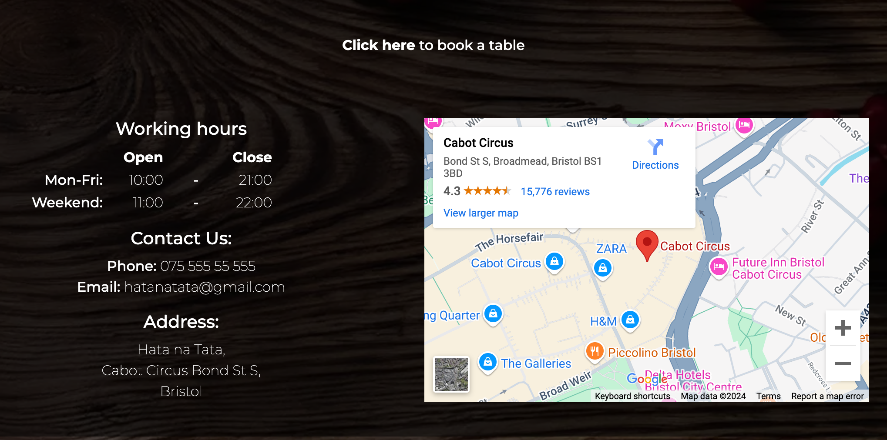

 __Navbar Menu__

- For better user experience, navigation links are located to right side of the navbar. I used white transparent background and black text to separate it from the other content. Also, I added logo image and the name of the restaurant to the left side of navbar on every page, despite main pages.
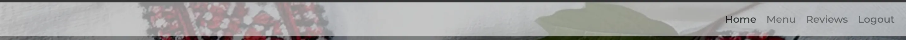

- For the small devices I added burger menu and logo with the name of the restaurant to the every page. Also, links are located to the right sight.


__Logged in/logged out user message__

- The user will be informed whether they are logged in or not.


__Booking Model__

- This reservation system enables users to easily book a table for evening dining. Key features include:
Guest Capacity: Choose from a limited selection of party sizes.
Time Slots: Select from a few predefined evening time options.
User-Friendly: Simplified choices streamline the booking process.
This model enhances customer convenience while helping restaurants manage reservations effectively. 
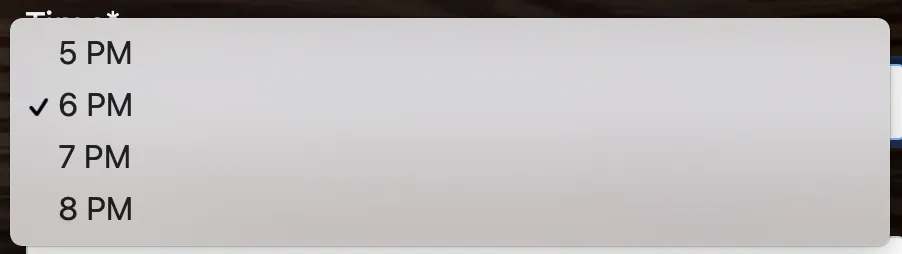
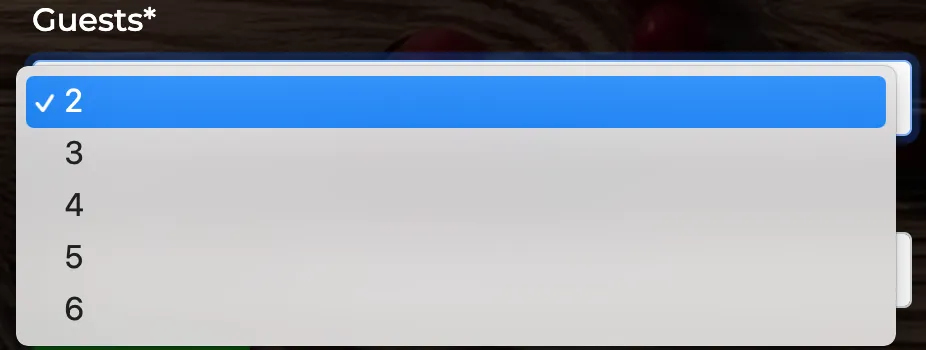
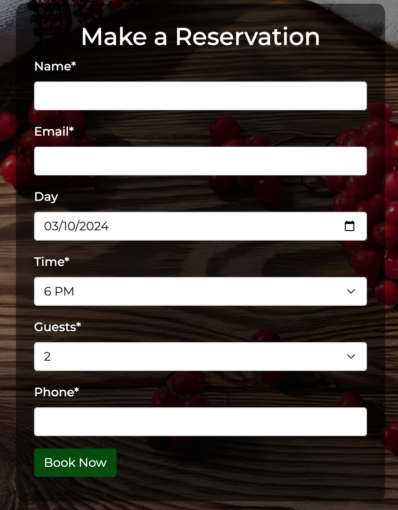

__Toast Messages__

- When you interact with the website, you'll receive toast messages that inform you about the success or failure of your actions. Whether you’re making a booking, registering, logging in or out, or adding a review, these notifications will provide immediate feedback on your activities. 
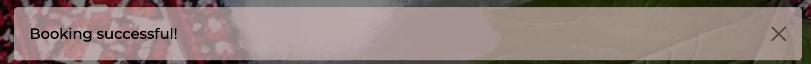


__Menu Page__

- On the menu page, you can explore detailed information about the dishes offered by the restaurant, organized into distinct sections for an enhanced user experience. One notable feature of the menu items is the use of logo images as placeholders, which are displayed when a specific dish image is not available.
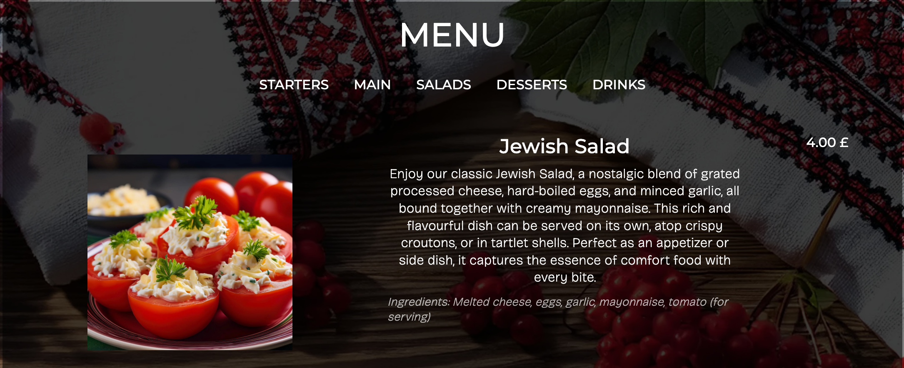
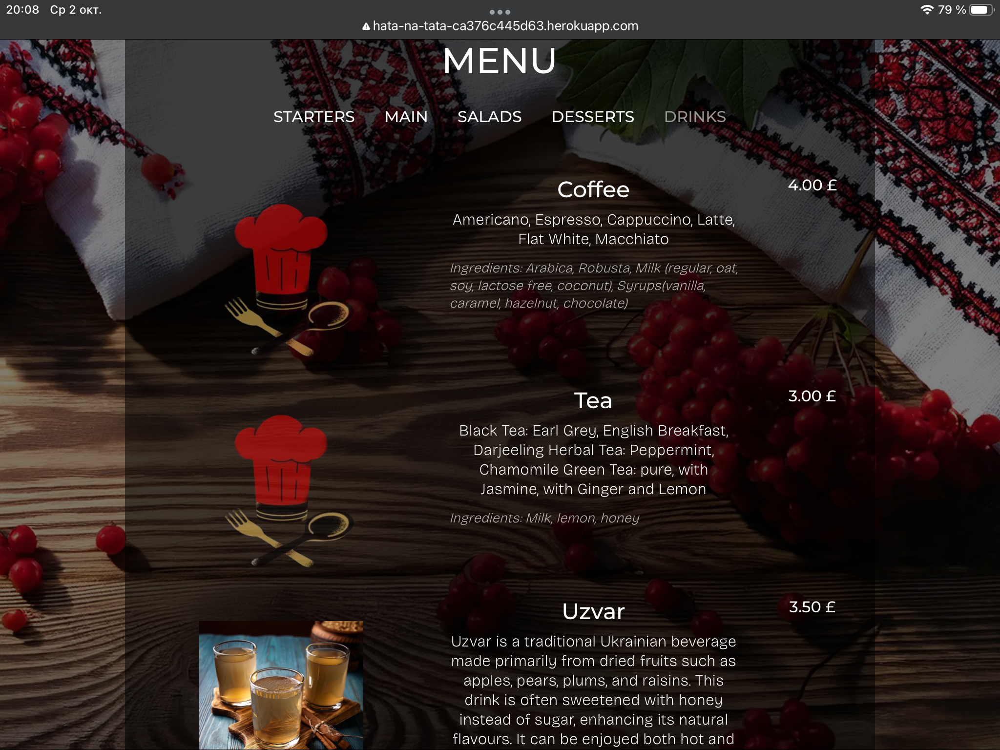

__Review Page__

- On this page, you can read reviews and leave your own if you are logged in. Additionally, you have the option to edit or delete your own reviews. 
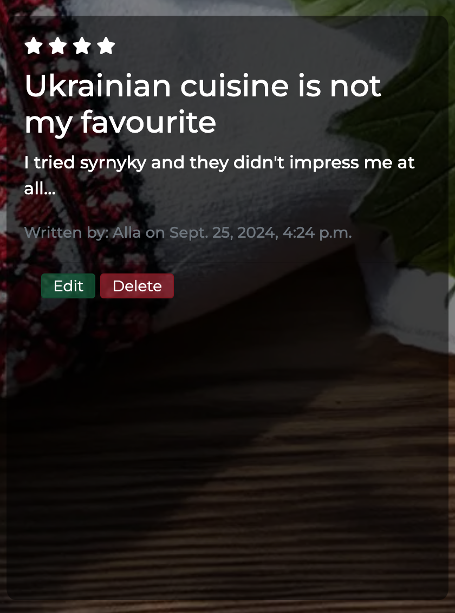
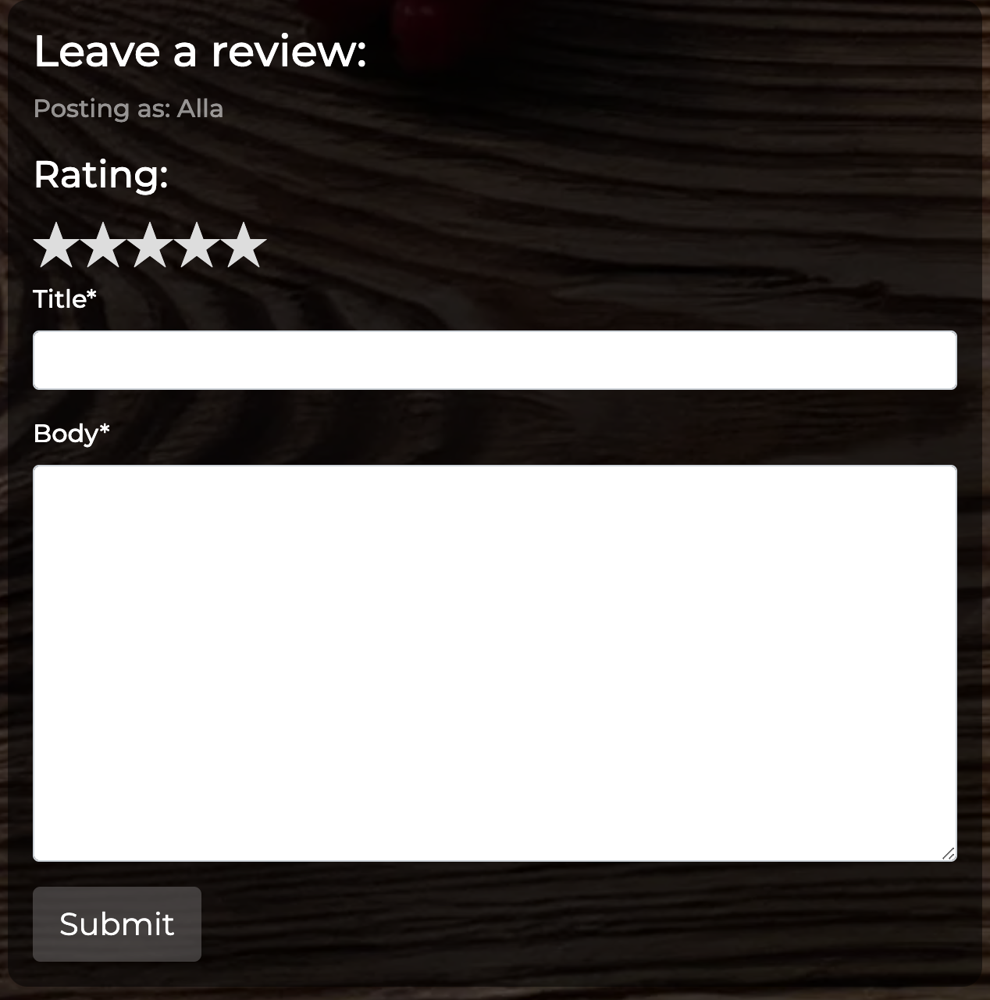

-  If you choose to delete your review, a confirmation message will appear to verify your decision before proceeding.
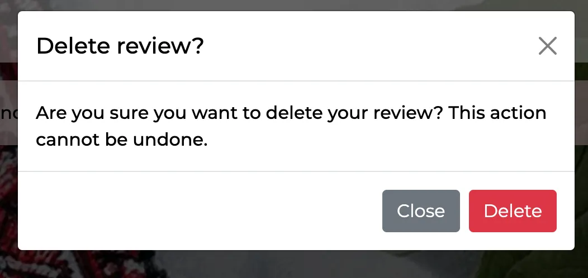

- If you decide to edit your review, you will be redirected to a separate page featuring the review form. There is also an option to cancel your changes if you change your mind.
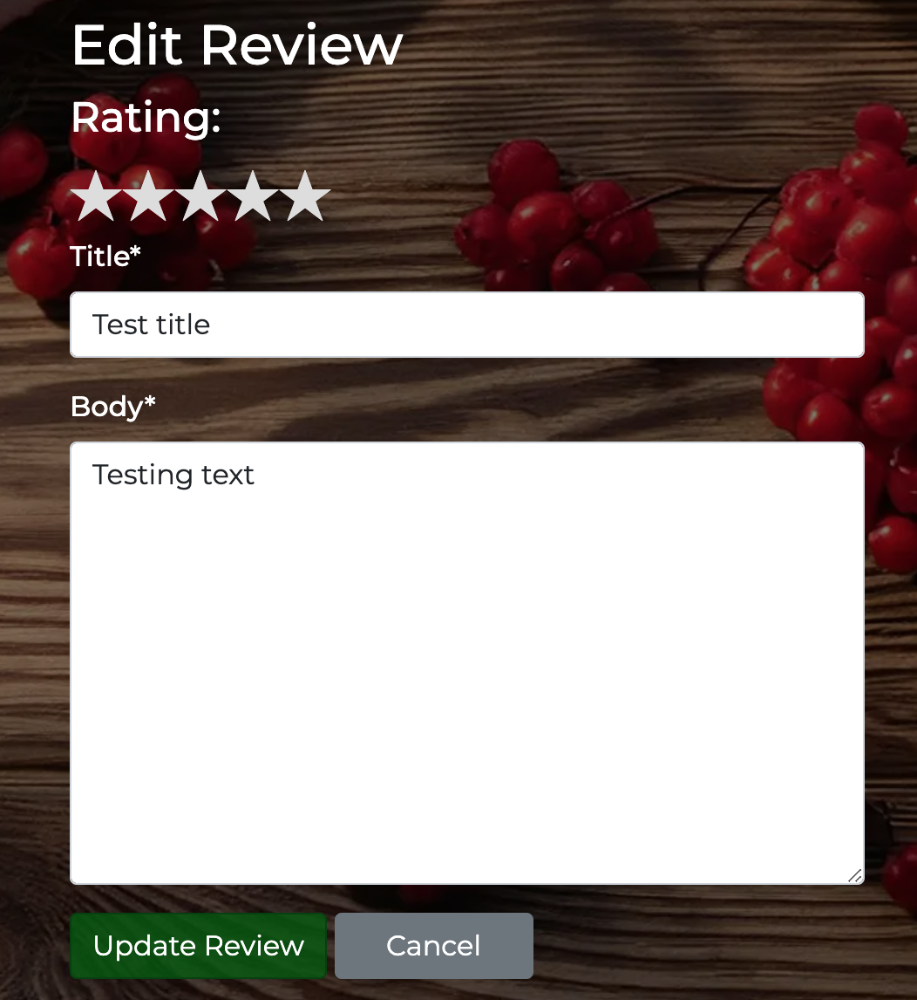


__Authorisation__

- Users can register, log in, and log out. Once authorized, they can access features such as making reservations and submitting reviews.
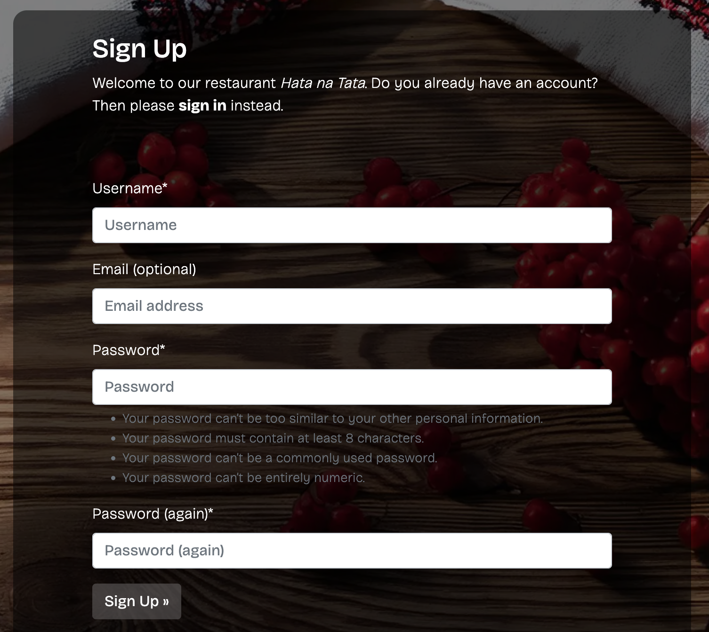
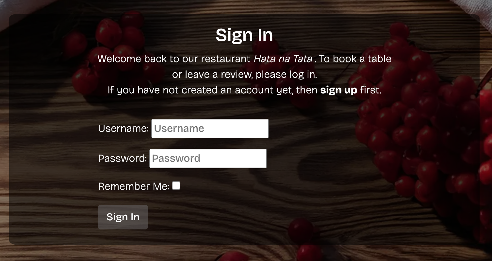
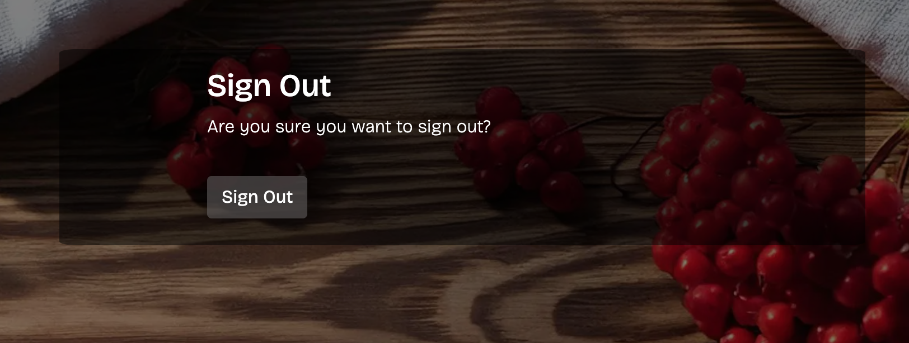
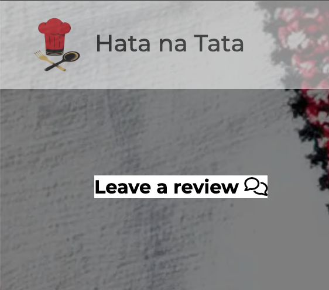
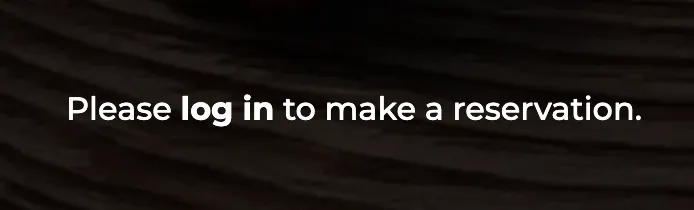
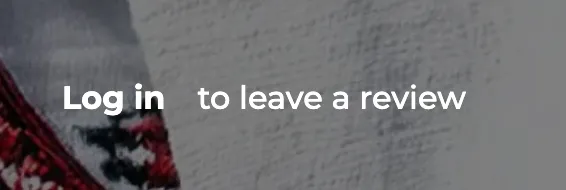


__The Footer__ 

- The footer section includes links to the relevant social media sites of Hata na Tata restaurant. The links will open to a new tab to allow easy navigation for the user. 
- The footer is valuable to the user as it encourages them to keep connected via social media
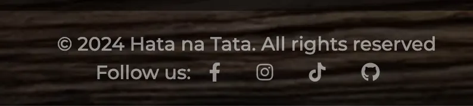


## Features Left to Implement

- In the future, I plan to include an About page. Additionally, I would like to enhance the booking form by adding a validator to manage limited table availability. 
- For the contact section, I aim to implement a form that allows users to send emails directly from the website without needing to open their mailbox.

# Database Schema - Entity Relationship Diagram

The Entity-Relationship Diagram (ERD) for Hata na Tata showcases the connections between users, reviews, and bookings. It also highlights that only admin or staff users have the privilege to add content to the menu page. 
This diagram is crucial in visualizing the relationships among various models within the PostgreSQL database.

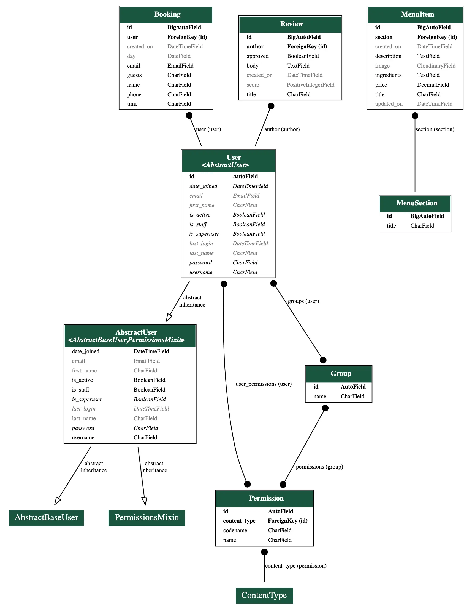

The above ERD was generated using Python Extension - pygraphviz and pydotplus. 
Documentation at (<https://django-extensions.readthedocs.io/en/latest/graph_models.html>).

# Agile Methodologies - Project Management

I used my [Github Projects Board](<https://github.com/users/Anka-S/projects/5>) to plan and document all of my work, initially I started with a [Trello](<https://trello.com/b/bRIJ6HZd/hata-na-tata-project>) board to allow myself to make some mistakes and gather any scraps of notes or information that I had and then refined them into my Projects board. I'm sure the next time around will be a smoother process.


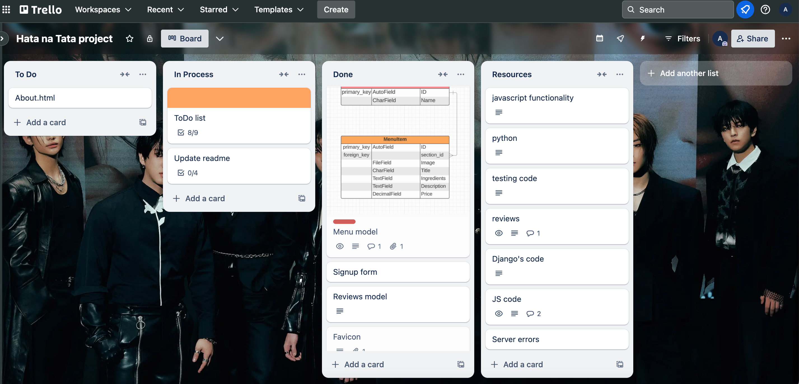

## MoSCoW Prioritization

I chose to follow the MoSCoW Prioritization method for Freefido, identifying and labelling my:

 - __Must Haves:__ the 'required', critical components of the project. Completing my 'Must Haves' helped me to reach the MVP (Minimum Viable Product) for this project early, allowing me to develop the project further than originally planned.

 - __Should Haves:__ the components that are valuable to the project but not absolutely 'vital' at the MVP stage. The 'Must Haves' must receive priority over the 'Should Haves'.

 - __Could Haves:__ these are the features that are a 'bonus' to the project, it would be nice to have them in this phase, but only if the most important issues have been completed first and time allows.

 - __Won't Haves:__ the features or components that either no longer fit the project's brief or are of very low priority for this release.
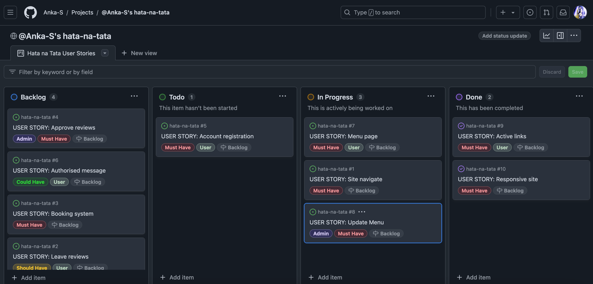


# Deployment

## Connecting to GitHub  

To begin this project from scratch, you must first create a new GitHub repository using the [Code Institute's Template](https://github.com/Code-Institute-Org/ci-full-template). This template provides the relevant tools to get you started. To use this template:

1. Log in to [GitHub](https://github.com/) or create a new account.
2. Navigate to the above CI Full Template.
3. Click '**Use this template**' -> '**Create a new repository**'.
4. Choose a new repository name and click '**Create repository from template**'.
5. In your new repository space, click the purple CodeAnywhere (if this is your IDE of choice) button to generate a new workspace.

## Django Project Setup

1. Install Django and supporting libraries: 
   
- ```pip3 install 'django<4' gunicorn```
- ```pip3 install dj_database_url psycopg2```
- ```pip3 install dj3-cloudinary-storage```  
  
2. Once you have installed any relevant dependencies or libraries, such as the ones listed above, it is important to create a **requirements.txt** file and add all installed libraries to it with the ```pip3 freeze --local > requirements.txt``` command in the terminal.  
3. Create a new Django project in the terminal ```django-admin startproject hatanatata .```
4. Create a new app eg. ```python3 mangage.py startapp review```
5. Add this to list of **INSTALLED_APPS** in **settings.py** - 'review',
6. Create a superuser for the project to allow Admin access and enter credentials: ```python3 manage.py createsuperuser```
7. Migrate the changes with commands: ```python3 manage.py migrate```
8. An **env.py** file must be created to store all protected data such as the **DATABASE_URL** and **SECRET_KEY**. These may be called upon in your project's **settings.py** file along with your Database configurations. The **env.py** file must be added to your **gitignore** file so that your important, protected information is not pushed to public viewing on GitHub. For adding to **env.py**:

- ```import os```
- ```os.environ["DATABASE_URL"]="<copiedURLfromCI>"```
- ```os.environ["SECRET_KEY"]="my_super^secret@key"```

For adding to **settings.py**:

- ```import os```
- ```import dj_database_url```
- ```if os.path.exists("env.py"):```
- ```import env```
- ```SECRET_KEY = os.environ.get('SECRET_KEY')``` (actual key hidden within env.py)  

9. Replace **DATABASES** with:

```
DATABASES = {
    'default': dj_database_url.parse(os.environ.get("DATABASE_URL"))
  }
```

10. Set up the templates directory in **settings.py**:
- Under ``BASE_DIR`` enter ``TEMPLATES_DIR = os.path.join(BASE_DIR, ‘templates’)``
- Update ``TEMPLATES = 'DIRS': [TEMPLATES_DIR]`` with:

```
os.path.join(BASE_DIR, 'templates'),
os.path.join(BASE_DIR, 'templates', 'allauth')
```

- Create the media, static and templates directories in top level of project file in IDE workspace.

11. A **Procfile** must be created within the project repo for Heroku deployment with the following placed within it: ```web: gunicorn hatanatata.wsgi```
12. Make the necessary migrations again.

## Cloudinary API 

Cloudinary provides a cloud hosting solution for media storage. All uploaded images for the menu items are hosted here.

Set up a new account at [Cloudinary](https://cloudinary.com/) and add your Cloudinary API environment variable to your **env.py** and Heroku Config Vars.
In your project workspace: 

- Add Cloudinary libraries to INSTALLED_APPS in settings.py 
- In the order: 
```
   'cloudinary_storage',  
   'django.contrib.staticfiles',  
   'cloudinary',
```
- Add to **env.py** and link up with **settings.py**: ```os.environ["CLOUDINARY_URL"]="cloudinary://...."``` 
- Set Cloudinary as storage for media and static files in settings.py:
- ```STATIC_URL = '/static/'```
```
  STATICFILES_DIRS = [os.path.join(BASE_DIR, 'static'), ]  
  STATIC_ROOT = os.path.join(BASE_DIR, 'staticfiles')‌  
```
## Heroku deployment

To start the deployment process , please follow the below steps:

1. Log in to [Heroku](https://id.heroku.com/login) or create an account if you are a new user.
2. Once logged in, in the Heroku Dashboard, navigate to the '**New**' button in the top, right corner, and select '**Create New App**'.
3. Enter an app name and choose your region. Click '**Create App**'. 
4. In the Deploy tab, click on the '**Settings**', reach the '**Config Vars**' section and click on '**Reveal Config Vars**'. Here you will enter KEY:VALUE pairs for the app to run successfully. The KEY:VALUE pairs that you will need are your: 
   
   - **CLOUDINARY_URL**: **cloudinary://....** 
   - **DATABASE_URL**:**postgres://...** 
   - **DISABLE_COLLECTSTATIC** of value '1' (N.B Remove this Config Var before deployment),
   -  **PORT**:**8000**
   -  **SECRET_KEY** and value  
  
5. Add the Heroku host name into **ALLOWED_HOSTS** in your projects **settings.py file** -> ```['herokuappname', ‘localhost’, ‘8000 port url’].```
6. Once you are sure that you have set up the required files including your requirements.txt and Procfile, you have ensured that **DEBUG=False**, save your project, add the files, commit for initial deployment and push the data to GitHub.
7. Go to the '**Deploy**' tab and choose GitHub as the Deployment method.
8. Search for the repository name, select the branch that you would like to build from, and connect it via the '**Connect**' button.
9.  Choose from '**Automatic**' or '**Manual**' deployment options, I chose the 'Manual' deployment method. Click '**Deploy Branch**'.
10. Once the waiting period for the app to build has finished, click the '**View**' link to bring you to your newly deployed site. If you receive any errors, Heroku will display a reason in the app build log for you to investigate. **DISABLE_COLLECTSTATIC**  may be removed from the Config Vars once you have saved and pushed an image within your project, as can **PORT:8000**.

# Technologies Used

- HTML5
- CSS3
- Python
  - asgiref==3.8.1
  - gunicorn==20.1.0
  - psycopg==3.2.2
  - PyJWT==2.9.0
  - python3-openid==3.2.0
  - requests-oauthlib==2.0.0
  - sqlparse==0.5.1
  - urllib3==1.26.20
  - whitenoise==5.3.0
- Django
  - dj-database-url==0.5.0
  - Django==4.2.14
  - django-allauth==0.57.2
  - django-crispy-forms==2.3
  - dj3-cloudinary-storage==0.0.6
  - django-extensions==3.2.3
  - django-summernote==0.8.20.0
- Cloudinary
  - cloudinary==1.41.0
- Heroku
- GitHub
- GitHub Projects


# Testing 
## Validator Testing 

### HTML

For my HTML files I have used [HTML W3C Validator](https://validator.w3.org) to validate all of my HTML files.

I have had to follow a different approach for validating my HTML for this project as the majority of my pages are developed using Jinja syntax such as '' and '{{ form|crispy }}' and most require user authentication. The HTML validator will throw errors if I were to use my website's URL so I have had to follow the below approach for every page:

- Via the deployed Heroku app link, I have navigated to each individual page.
- Right clicking on the screen/CTRL+U/⌘+U on Mac, allows a menu to appear, giving me the option to 'View page source'.
- The complete HTML code for the deployed page will appear, allowing you to select the entire code using CTRL+A/⌘+A on Mac.
- Paste the copied code into the [validate by input](https://validator.w3.org/#validate_by_input) option.
- Check for errors and warnings, fix any issues, revalidate by following the above steps and record the results.


All HTML pages were validated and received a 'No errors or warning to show' result as shown above.

<hr>

### CSS

[W3C CSS Validator](https://jigsaw.w3.org/css-validator/) was used to validate my CSS file. External CSS for Bootstrap, provided by [CDN](https://cdnjs.cloudflare.com/ajax/libs/bootstrap/5.2.3/css/bootstrap.min.css) was not tested. Warnings were present because of using vendor extentions for different browsers
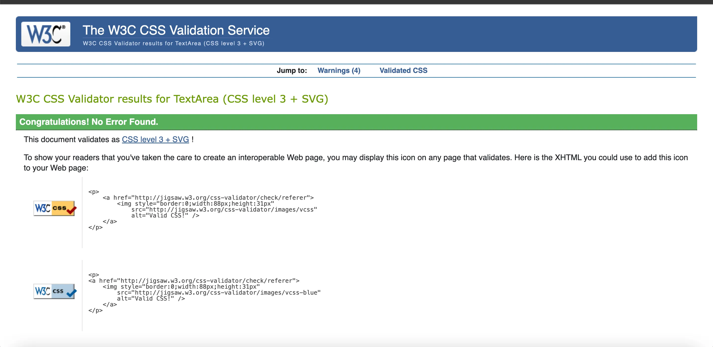
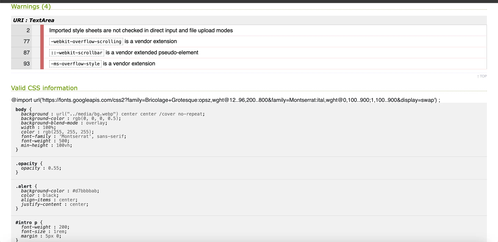
 
<hr>

### JavaScript

[JSHint](https://jshint.com/) was used to validate the small amount of JavaScript code added to the project. External JS, for Bootstrap purposes, obtained via [CDN](https://cdnjs.cloudflare.com/ajax/libs/bootstrap/5.2.3/js/bootstrap.min.js) was not validated through JSHint
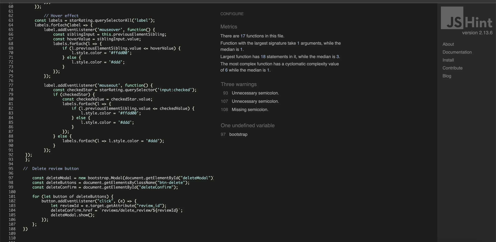

<hr>

### Python Validation

[CI Python Linter](https://pep8ci.herokuapp.com/#) was used to validate the Python files that were created or edited by myself. No issues presented and line lengths were double checked. I have included some screenshots with the results below.

| Feature | admin.py | forms.py | models.py | urls.py | views.py |
|---------|----------|----------|-----------|---------|----------|
| Booking  | [no errors](docs/testing/main-admin.webp) | [no errors](docs/testing/booking-form.webp) | [no errors](docs/testing/booking-model.webp) | [no errors](docs/testing/main-urls.webp) | [no errors](docs/testing/booking-view.webp) |
| Review | [no errors](docs/testing/review-admin.webp) | [no errors](docs/testing/review-form.webp) | [no errors](docs/testing/review-models.png) | [no errors](docs/testing/review-url.png) | [no errors](docs/testing/review-view.png) |
| Menu | [no errors](docs/testing/menu-admin.webp) | na | [no errors](docs/testing/menu-model.webp) | [no errors](docs/testing/menu-urls.webp) | [no errors](docs/testing/menu-view.webp) |

<hr>


### LightHouse

Lighthouse testing was carried out in Incognito mode to acheive the best result. Performance was lower than preferred due to the site used Cloudinary storage. Images used in the sites design were saved in webp and png format, and compressed using [tinypng](https://tinypng.com/) and [To WebP](https://towebp.io/) to offer the best chance for a decent performance score.
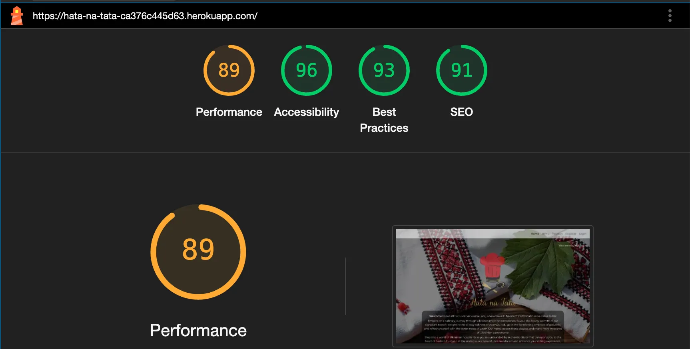
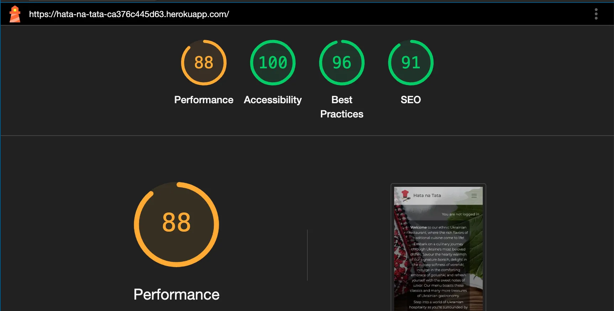

### Wave Accessibility Evaluation

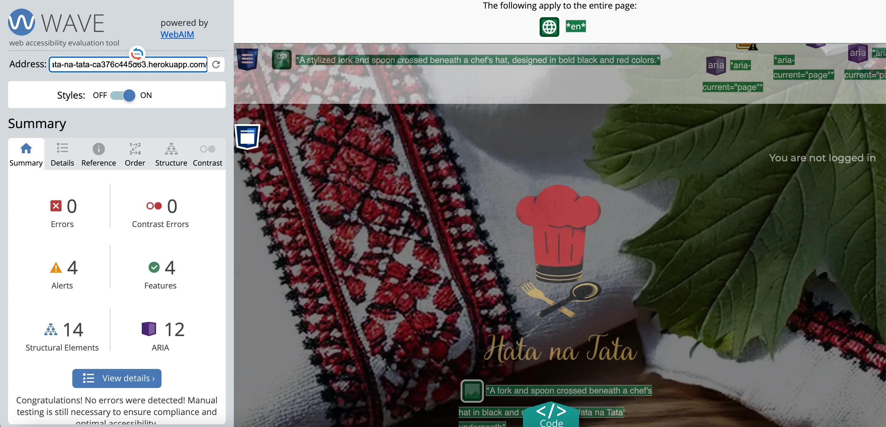
  
## Manual Testing
All features were tested on different devices(mobile, laptop, tablet)
| Feature | Tested? | Screenshots | User Feedback Provided | Pass/Fail |
|---------|---------|-------------|------------------------| ----------|
| Booking | Yes | [Filled form](docs/final_views/mobile/mobile-booking-test.webp) [Date in the past](docs/testing/invalid-date-msg.webp) [Invalid number](docs/testing/invalid-phone-msg.webp) [Date in the future](docs/testing/invalid-date.webp) [Success](docs/final_views/mobile/mobile-booking-approval.webp) | When the user tries to make a book table in the past, or more than a month in advance, or puts in an invalid phone number booking won't submit. When all data is correct, the booking is submitted and redirected to the main page.| Pass|
| Review | Yes | [Write review](docs/testing/write-review-test.webp) [Edit review](docs/final_views/mobile/mobile-review-edit.webp) [Delete review](docs/final_views/mobile/mobile-delete-alert.webp) [Review is awaiting for approval](docs/final_views/mobile/mobile-review-approval.webp) | Authorised users can write reviews, edit or delete it.| Pass|
| Logo | Yes | - | When you're clicking on the logo image in navbar, it will redirect you to the home page| Pass|
| Menu Page | Yes | [Menu view](docs/final_views/mobile/mobile-menu-desserts.webp) [Image zoomed](docs/final_views/mobile/mobile-menu-zoomedimg.webp) | If you want to see better the image for dish, you can click on it and it will zoomed. When you clicking again, it returns in regular size. On small devices you can use scrollbar for menu sections. Also colour of active links are slightly different from regular links. | Pass |

<hr>


# Credits 
- I was inspired by the Codestar Blog project from [Code Institute](https://learn.codeinstitute.net/) for creating a lot of content for my project
- From [FreeFido](https://github.com/amylour/FreeFido_v2/blob/main/README.md?plain=1#deployment) by [Amylour](https://github.com/amylour) I take her README as an example how to write it because it's written so good and well organised. Also, I take a look at how to add a validator for a date, to avoid making bookings in the past.

- I wanted to include star rating for my project, so I found the solution in the [CI capstone project](https://github.com/doctypeKieran/ci-capstone-project) by [Kieran](https://github.com/doctypeKieran)


## Content 

- Icon for webpage created with [Favicon generator](https://realfavicongenerator.net/)
- The icons in the footer were taken from [Font Awesome](https://fontawesome.com/)
- The CDN framework used for ready-made styling was [Bootstrap 5](https://getbootstrap.com/docs/5.0/getting-started/download/)
- [Balsamiq](https://balsamiq.com/) used for wireframe
- [Perplexity](https://www.perplexity.ai/) used for writing description for menu items and introduction. 
- [Trello](https://trello.com/u/anitravoin/boards) used for planning the work process
- [Canva](https://www.canva.com/) used for creating logo for website and for favicon
- [Removebg](https://www.remove.bg/) used for making background transparent on the logo image
- [Adobe Firefly](https://firefly.adobe.com/) used for creating images for the background and for menu items
